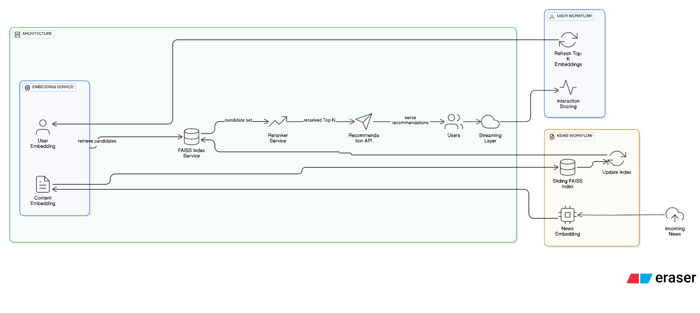

# Algorithms

Implemented 2 algorithms for new recommendation. Both approaches rely on embedding-based retrieval using FAISS. The main difference lies in the search space.
## Approach 1 – Full Content Embeddings

- Embedding Space: All content .​
- User Representation:​
    - For each user, select Top-K news interacted with, based on interaction
score.​
    - Compute weighted average embedding of these Top-K items.
​
- Inferencing:​
    - For each user, retrieve nearest neighbours from all
available content.​
    - Re-rank candidates using recency.​

## Approach 2 – Fresh Content Embeddings
- Embedding Space: Fresh content.
- User Representation: Same as Approach 1 (Top-K weighted average).
- Inferencing:
    - Nearest neighbours are retrieved only from the validation set (i.e., news
available at that time).
    - Re-ranked with recency.​
​
# Algorithm Components
## Data Preprocessing
- Custom CSV Parser developed to handle multilingual content and
emoticons, ensuring correct tokenization and embedding input.​
## Interaction Scoring
- Each user’s Top-K news are chosen based on a composite score:
    - Event Type: Higher weight for strong signals (e.g., bookmarks > clicks).
    - Time Spent: Longer reading time indicates higher interest.
    - Relevancy Color Feedback: Explicit signals (green > yellow > red).​
## Cold Start Strategy
- For new users with no history:
    - Recommend Top-K popular and recent news articles.
- Ensures recommendations even for first-time users.​
## Embedding Generation
- Multilingual model `multilingual-e5-base` used to cover diverse language
inputs.
- News embedding = weighted average of:​
    - Title embedding.
    - Content embedding.
    - Metadata embedding.​
## Vector Indexing
- Embeddings are L2-normalized.​
-   Stored in `FAISS` index for efficient nearest neighbour retrieval.
- Supports large-scale retrieval in milliseconds.​
## Reranking
- After FAISS retrieval, candidate news are re-ranked based on recency.
​
# Architechture for productization
